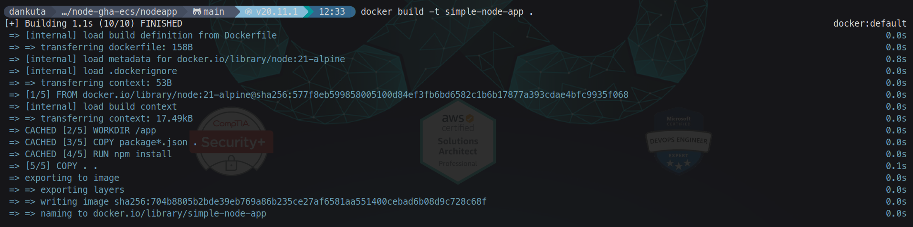
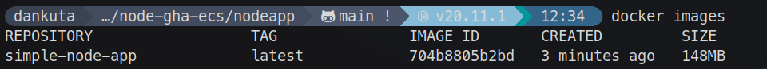
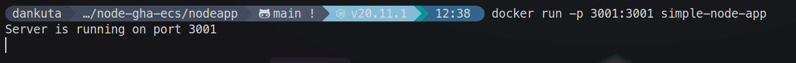
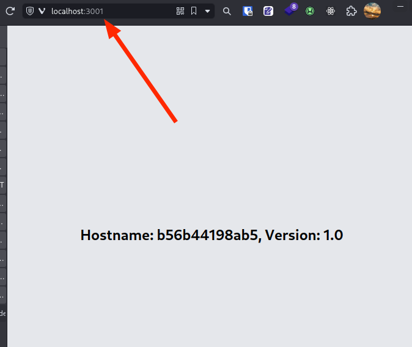

# How to Containerize an Application with Docker

Docker is a popular platform for building, deploying, and running applications using containers. Containers provide a lightweight, isolated, and portable environment for your applications, making it easier to develop, distribute, and run them consistently across different environments.

## Prerequisites

- Before you begin, ensure that you have Docker installed on your machine. You can download and install Docker Desktop from the official website: <https://www.docker.com/products/docker-desktop>

- This example will walk you through containerizing a simple NodeJS application that outputs the hostname of the server it is running on and a version number.

```js
const express = require('express');
const os = require('os');
const path = require('path');

const app = express();

const PORT = process.env.PORT || 3001;
const VERSION = '1.0';

app.get('/serverinfo', (req, res) => {
    const hostname = os.hostname();
    res.send(`Hostname: ${hostname}, Version: ${VERSION}`);
});

app.get('/', (req, res) => {
    res.sendFile('index.html', {
    root: path.join(__dirname, './views/')
    })
})

app.listen(PORT, () => {
    console.log(`Server is running on port ${PORT}`);
});
```

## Step 1: Create a Dockerfile

A Dockerfile is a text file that contains instructions for building a Docker image. It specifies the base image, dependencies, environment variables, and commands required to run your application.

- Create a new file named `Dockerfile` in the root directory of your project.

```sh
./
├── node_modules/
├── views/
├── Dockerfile
├── package.json
├── pnpm-lock.yaml
└── server.js
```

- Open the `Dockerfile` in a text editor and add the following contents:

```dockerfile
# Use an official Node.js image as the base image from hub.docker.com
FROM node::21-alpine

# Set the working directory in the container
WORKDIR /app

# Copy package.json and package-lock.json (if available)
COPY package*.json ./

# Install dependencies
RUN npm install

# Copy the rest of the application code
COPY . .

# Expose the port your application listens on
EXPOSE 3001

# Start the application
CMD ["node", "server.js"]
```

> Note: This example uses a Node.js application, but you can modify the base image and commands according to your application's requirements.

## Step 2: Build the Docker Image

With the `Dockerfile` in place, you can now build the Docker image for your application.

- Open a terminal or command prompt and navigate to the root directory of your project where the `Dockerfile` is located.
- Run the following command to build the Docker image:

```sh
docker build -t simple-node-app .
```

> Replace `simple-node-app` with a desired name for your Docker image.

Docker will follow the instructions in the `Dockerfile` and build a new image for your application.



- You can view your docker images by running

```sh
docker images
```



## Step 3: Run the Docker Container

After successfully building the Docker image, you can run a container based on that image.

1. Run the following command to start a new container:

```sh
docker run -p 3001:3001 simple-node-app
```

This command maps the container's port 3001 to the host's port 3001. You can change the host port if you need to use a different port on your machine.

> ***Remember:** host-port:container-port*



## Step 4: Verify the Application

Once the container is running, you can access your application by opening a web browser and navigating to `http://localhost:3001` (or the appropriate URL and port based on your application).



Congratulations! You have successfully containerized your application with Docker. The next step will be to push that image to a container repository like Docker Hub, so it can be pulled and deployed elsewhere.
