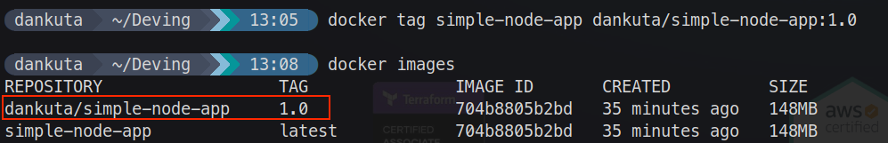
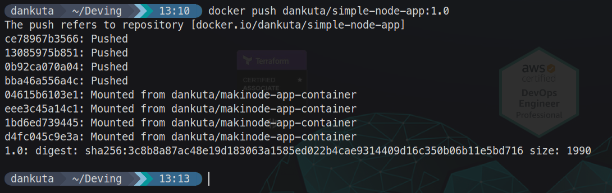
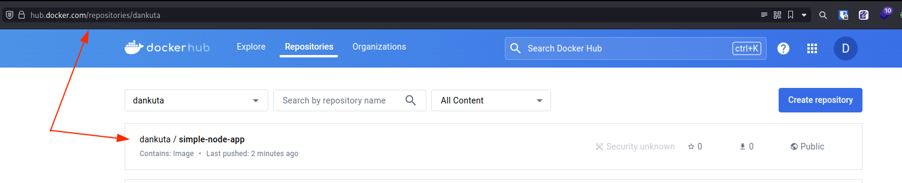

# How to Push a Container Image to Docker Hub

Docker Hub is a cloud-based registry service provided by Docker. It allows you to store and distribute Docker images, making it easier to share your containerized applications with others or use them across different environments.

## Prerequisites

Before you begin, ensure that you have the following:

1. A Docker Hub account. If you don't have one, you can sign up for free at <https://hub.docker.com>.
2. Docker installed on your machine. You can download and install Docker Desktop from the official website: <https://www.docker.com/products/docker-desktop>.
3. A Docker image that you want to push to Docker Hub. See [previous step](./01%20-%20How%20to%20containerize%20an%20Application%20with%20Docker.md), if you need help with this.

## Step 1: Log in to Docker Hub

- Open a terminal or command prompt.
- Run the following command to log in to your Docker Hub account:

```sh
docker login
```

- Enter your Docker Hub username and password when prompted.

## Step 2: Tag the Docker Image

Before pushing your Docker image to Docker Hub, you need to tag it with your Docker Hub username and a repository name.

- Run the following command to tag your Docker image:

```sh
docker tag simple-node-app YOUR_DOCKER_HUB_USERNAME/simple-node-app:1.0
```

> Replace `simple-node-app` with the name of your Docker image, and `YOUR_DOCKER_HUB_USERNAME` with your actual Docker Hub username.

- Run `docker images` to view your newly tagged image.



## Step 3: Push the Docker Image to Docker Hub

With your Docker image tagged, you can now push it to Docker Hub.

- Run the following command to push your Docker image to Docker Hub:

```sh
docker push YOUR_DOCKER_HUB_USERNAME/simple-node-app:1.0
```

> Replace `YOUR_DOCKER_HUB_USERNAME` with your actual Docker Hub username, and `simple-node-app` with the name of your Docker image repository.

Docker will start uploading your Docker image to Docker Hub.



## Step 4: Verify the Pushed Docker Image

After successfully pushing your Docker image to Docker Hub, you can verify it by visiting your Docker Hub repository online.

1. Open a web browser and navigate to <https://hub.docker.com>.
2. Log in to your Docker Hub account if you haven't already.
3. In the "Repositories" section, you should see the repository you just pushed your Docker image to.



Congratulations! You have successfully pushed your Docker image to Docker Hub. You can now share your containerized application with others or use it across different environments by pulling the image from Docker Hub.
