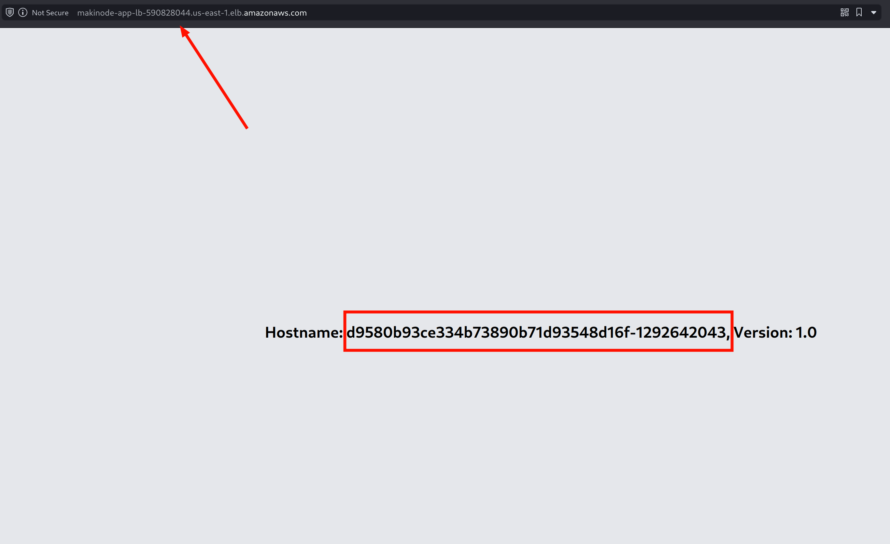

# How to provision and deploy to ECS with Terraform

Amazon Elastic Container Service (ECS) is a fully-managed container orchestration service provided by Amazon Web Services (AWS). It allows you to deploy, manage, and scale containerized applications across a cluster of Amazon Elastic Compute Cloud (EC2) instances.

Terraform is an open-source Infrastructure as Code (IaC) tool that allows you to provision and manage cloud resources, including Amazon Elastic Container Service (ECS), in a declarative way. In this documentation, we'll guide you through the process of deploying a Docker image to ECS using Terraform.

## Prerequisites

Before you begin, ensure that you have the following:

1. An AWS account. If you don't have one, you can sign up for a free tier account at [https://aws.amazon.com](https://aws.amazon.com/).
2. Terraform installed on your machine. You can download Terraform from the official website: [https://www.terraform.io/downloads.html](https://www.terraform.io/downloads.html). You can also use [tfenv](https://github.com/tfutils/tfenv) to install and manage Terraform versions.
3. The AWS Command Line Interface (CLI) installed and configured on your machine. You can find instructions for installing and configuring the AWS CLI at [https://docs.aws.amazon.com/cli/latest/userguide/cli-chap-install.html](https://docs.aws.amazon.com/cli/latest/userguide/cli-chap-install.html).
4. A Docker image that you want to deploy to ECS. This image should be available in a Docker registry, such as Docker Hub or Amazon Elastic Container Registry (ECR). This walk-through will you the `simple-node-app` image from a [previous step](./)

> Terraform allows you define all resources in one file or in multiple files. For better code maintenance and easy understanding, we will break the code into separate files. We will have `networking.tf` for all our networking resources, `ecs.tf` for defining the core ECS resources and configurations, `loadbalancer.tf` for defining all resources related to the load balancer and target group and listener,

## Step 0: Initialize Terraform

- Create a new directory for this project to hold the Terraform configuration files.
- Create a file named `provider.tf` to hold all terraform configurations relating to the providers and plugins terraform would need to run our project. In the file, add AWS as a provider and define the region the resources should be deployed into. Visit the [Terraform Registry](https://registry.terraform.io/providers/hashicorp/aws/latest) to find the latest version.

```hcl
terraform {
  required_providers {
    aws = {
      source = "hashicorp/aws"
      version = "5.41.0"
    }
  }
}

provider "aws" {
  region = us-east-1
}
```

- Open a terminal or command prompt and navigate to the newly created directory.
- Run the following command to initialize Terraform:

```sh
terraform init
```

This command downloads the necessary provider plugins and prepares the working directory for Terraform.


## Step 1: Create The Networking Infrastructure

First, we will focus attention on creating the resources that enable proper networking configurations and allow our application become accessible, such as VPC, Subnets, Internet Gateway, Route Tables and Security Group.

File: `networking.tf`

- Create a Virtual Private Cloud (VPC) named `makinode_vpc` with the CIDR block "10.0.0.0/16". A VPC is a logically isolated virtual network in AWS.

```hcl
# Create a VPC
resource "aws_vpc" "makinode_vpc" {
  cidr_block = "10.0.0.0/16"
  tags = {
    Name = "Makinode VPC"
  }
}
```

- Create two public subnets within the `makinode_vpc`.

```hcl
# Create public subnets
resource "aws_subnet" "public_subnets" {
  count                   = 2
  vpc_id                  = aws_vpc.makinode_vpc.id
  cidr_block              = "10.0.${count.index + 1}.0/24"
  availability_zone       = data.aws_availability_zones.available.names[count.index]
  map_public_ip_on_launch = true
  tags = {
    Name = "Public Subnet ${count.index + 1}"
  }
}

# Get list of availability zones
data "aws_availability_zones" "available" {
  state = "available"
}
```

> `count = 2` specifies that two subnets will be created.
>
> `vpc_id` sets the VPC where the subnets should be created, using the ID of the `makinode_vpc` resource.
> `cidr_block` dynamically sets the CIDR block for each subnet using the `count.index` value. The first subnet will have a CIDR block of "10.0.1.0/24", and the second will have "10.0.2.0/24".
>
> `availability_zone` dynamically sets the Availability Zone for each subnet using the `data.aws_availability_zones.available.names[count.index]` data source, which retrieves the available Availability Zones in the current AWS region.
>
> `map_public_ip_on_launch = true` automatically assigns a public IP address to instances launched in these public subnets.
> `tags` sets a Name tag for each subnet with a dynamically generated value based on the `count.index`.

- Create an Internet Gateway and associate it with the `makinode_vpc`. An Internet Gateway is a component that allows communication between the VPC and the internet.

```hcl
# Create an Internet Gateway
resource "aws_internet_gateway" "igw" {
  vpc_id = aws_vpc.makinode_vpc.id
  tags = {
    Name = "Internet Gateway"
  }
}
```

- Create a Route Table and associate it with the `makinode_vpc`.

```hcl
# Create a public route table
resource "aws_route_table" "public_rt" {
  vpc_id = aws_vpc.makinode_vpc.id
  route {
    cidr_block = "0.0.0.0/0"
    gateway_id = aws_internet_gateway.igw.id
  }
  tags = {
    Name = "Public Route Table"
  }
}
```

> The Route Table has a route that sends all traffic (`cidr_block = "0.0.0.0/0"`) to the Internet Gateway (`gateway_id = aws_internet_gateway.igw.id`).

- Associate the subnets created earlier with the `public_rt` Route Table, allowing resources in those subnets to access the internet. This is what makes the subnets "public", because when subnets are created, they are private by default.

```hcl
# Associate public subnets with the public route table
resource "aws_route_table_association" "public_rt_associations" {
  count          = length(aws_subnet.public_subnets)
  subnet_id      = aws_subnet.public_subnets[count.index].id
  route_table_id = aws_route_table.public_rt.id
}
```

> `count = length(aws_subnet.public_subnets)` sets the count to the length of the `aws_subnet.public_subnets` resource list, ensuring that an association is created for each public subnet.
>
> `subnet_id = aws_subnet.public_subnets[count.index].id` dynamically sets the `subnet_id` using the ID of each public subnet, based on the `count.index` value.
>
> `route_table_id = aws_route_table.public_rt.id` sets the `route_table_id` to the ID of the `public_rt` Route Table.

- Create a Security Group named `makinode_app_sg`. Security groups in AWS act as firewalls that determine what traffic are allowed to and fro their associated resources.

```hcl
# Create a security group
resource "aws_security_group" "makinode_app_sg" {
  name        = "app-sg"
  description = "Allow inbound traffic on ports 3001 and 80"
  vpc_id      = aws_vpc.makinode_vpc.id
  ingress {
    from_port       = 3001
    to_port         = 3001
    protocol        = "tcp"
    cidr_blocks     = ["0.0.0.0/0"]
  }
  ingress {
    from_port       = 80
    to_port         = 80
    protocol        = "tcp"
    cidr_blocks     = ["0.0.0.0/0"]
  }
  egress {
    from_port       = 0
    to_port         = 0
    protocol        = "-1"
    cidr_blocks     = ["0.0.0.0/0"]
  }
  tags = {
    Name = "App Security Group"
  }
}
```

> The Security Group allows inbound traffic on ports 3001 and 80 from any IP address (`cidr_blocks = ["0.0.0.0/0"]`). It also allows all outbound traffic (`from_port = 0`, `to_port = 0`, `protocol = "-1"`, `cidr_blocks = ["0.0.0.0/0"]`). This Security Group can be applied to resources like the Application Load Balancer.

## Step 2: Creating the Load Balancer

File: `loadbalancer.tf`

- Create an Application Load Balancer (ALB) named "app-lb" in AWS.

```hcl
# Create an Application Load Balancer
resource "aws_lb" "makinode_app_lb" {
  name               = "makinode-app-lb"
  load_balancer_type = "application"
  subnets            = [aws_subnet.public_subnet[0].id, aws_subnet.public_subnet[1].id]
  security_groups    = [aws_security_group.makinode_app_sg.id]
}
```

> The `load_balancer_type` is set to "application", indicating it's an Application Load Balancer.
>
> The `subnets` argument specifies the public subnets where the load balancer should be deployed, using the IDs of the `public_subnet[0]` and `public_subnet[1]` resources.
>
> The `security_groups` argument sets the security group to be applied to the load balancer, using the ID of the `makinode_app_sg` resource.

- Create a Target Group for the Application Load Balancer. A Target Group is used to route traffic to registered targets (e.g., EC2 instances or ECS tasks).

```hcl
# Create a Target Group for the Load Balancer
resource "aws_lb_target_group" "makinode_app_tg" {
  name        = "makinode-app-tg"
  port        = 3001
  protocol    = "HTTP"
  vpc_id      = aws_vpc.makinode_vpc.id
  target_type = "ip"
}
```

> The `port` is set to 3001, indicating that the targets will receive traffic on this port.
>
> The `protocol` is set to "HTTP".
>
> The `vpc_id` specifies the VPC where the Target Group should be created, using the ID of the `makinode_vpc` resource.
>
> The `target_type` is set to "ip", meaning that the targets will be registered by their IP addresses.

- Create a Listener for the Application Load Balancer. A Listener is used to check for connection requests and forward them to the targets in the Target Group.

```hcl
# Create a Listener for the Load Balancer
resource "aws_lb_listener" "makinode_app_listener" {
  load_balancer_arn = aws_lb.makinode_app_lb.arn
  port              = 80
  protocol          = "HTTP"
  default_action {
    type             = "forward"
    target_group_arn = aws_lb_target_group.makinode_app_tg.arn
  }
}
```

 > The `load_balancer_arn` specifies the ARN (Amazon Resource Name) of the `makinode_app_lb` load balancer.
 >
 > The `port` is set to 80, indicating that the listener will listen for incoming traffic on port 80.
 >
 > The `protocol` is set to "HTTP".
 >
 > The `default_action` block specifies the action to take when a request is received. In this case, the `type` is set to "forward", meaning that the requests will be forwarded to the Target Group specified by the `target_group_arn`, which is the ARN of the `makinode_app_tg` Target Group.

- Add an output block to get the load balancer's DNS name. This will be printed in the terminal and gives us the address to visit in the browser.

```hcl
output "load_balancer_dns" {
  description = "The DNS name of the load balancer"
  value = aws_lb.makinode_app_lb.dns_name
}
```

## Step 3: Create & Configure the ECS Resources

Now, we will focus on building the core ECS resources in a file named `ecs.tf`. It will hold the definitions for the cluster, task execution role, task definition, and the ecs service.

File: `ecs.tf`

- Create an Amazon Elastic Container Service (ECS) cluster with the name `makinode-app-cluster`. An ECS cluster is a logical grouping of EC2 instances or Fargate tasks that run your containerized applications.

```hcl
# Create the ECS cluster
resource "aws_ecs_cluster" "makinode_app_cluster" {
  name = "makinode-app-cluster"
}
```

- Create an AWS Identity and Access Management (IAM) role named `ecs-task-execution-role`. This role is used by the ECS tasks to access other AWS resources, such as ECR (Elastic Container Registry) or CloudWatch Logs. The `assume_role_policy` defines the permissions for the ECS tasks to assume this role.

```hcl
resource "aws_iam_role" "ecs_task_role" {
  name = "ecs-task-execution-role"

  assume_role_policy = <<EOF
{
  "Version": "2012-10-17",
  "Statement": [
    {
      "Effect": "Allow",
      "Principal": {
        "Service": "ecs-tasks.amazonaws.com"
      },
      "Action": "sts:AssumeRole"
    }
  ]
}
EOF
}
```

- Attach the `AmazonECSTaskExecutionRolePolicy` managed policy to the `ecs_task_role` created in the previous block. This policy provides the necessary permissions for the ECS tasks to run and interact with other AWS services.

```hcl
resource "aws_iam_role_policy_attachment" "ecs_task_role_policy_attachment" {
  role       = aws_iam_role.ecs_task_role.name
  policy_arn = "arn:aws:iam::aws:policy/service-role/AmazonECSTaskExecutionRolePolicy"
}
```

- Create an ECS task definition named `makinode-app-task`. A task definition describes one or more containerized applications, including the Docker image, resource requirements, and networking settings.

```hcl
# Create the task definition
resource "aws_ecs_task_definition" "makinode_app_task" {
  family                   = "makinode-app-task"
  network_mode             = "awsvpc"
  requires_compatibilities = ["FARGATE"]
  cpu                      = "256"
  memory                   = "512"

  execution_role_arn = aws_iam_role.ecs_task_role.arn

  container_definitions = <<DEFINITION
    [
        {
            "name": "makinode-app-container",
            "image": "dankuta/simple-node-app:1.0",
            "portMappings": [
                {
                    "containerPort": 3001,
                    "hostPort": 3001
                }
            ]
        }
    ]
    DEFINITION
}
```

> `family`: Specifies the family name for the task definition.
>
> `network_mode`: Specifies the networking mode for the task, in this case, "awsvpc" (AWS Virtual Private Cloud).
>
> `requires_compatibilities`: Specifies that the task definition is compatible with the Fargate launch type.
>
> `cpu` and `memory`: Specify the CPU and memory resources to be allocated for the task.
>
> `execution_role_arn`: Specifies the IAM role (`ecs_task_role`) that the task should assume.
>
> `container_definitions`: Specifies the container definition for the Docker image. It includes the name of the container, the Docker image URL (which in this case is `dankuta/simple-node-app:1.0`), and the port mappings for the container.

- Create an ECS service named `makinode-app-service`. An ECS service is responsible for running and maintaining the desired number of tasks based on the task definition.

```hcl
# Create the ECS service
resource "aws_ecs_service" "makinode_app_service" {
  name            = "makinode-app-service"
  cluster         = aws_ecs_cluster.makinode_app_cluster.id
  task_definition = aws_ecs_task_definition.makinode_app_task.arn
  desired_count   = 2
  launch_type     = "FARGATE"

  network_configuration {
    subnets          = [aws_subnet.public_subnets[0].id, aws_subnet.public_subnets[1].id]
    assign_public_ip = true
    security_groups  = [aws_security_group.makinode_app_sg.id]
  }

  load_balancer {
    target_group_arn = aws_lb_target_group.makinode_app_tg.arn
    container_name   = "makinode-app-container"
    container_port   = 3001
  }

  depends_on = [aws_lb_listener.makinode_app_listener]
}
```

> `name`: Specifies the name of the ECS service.
>
> `cluster`: Specifies the ECS cluster where the service should run, using the ID of the `makinode_app_cluster` cluster created earlier.
>
> `task_definition`: Specifies the task definition (`makinode_app_task`) to be used for running the tasks.
>
> `desired_count`: Specifies the desired number of tasks to be running in the service, in this case, 2.
>
> `launch_type`: Specifies the launch type for the tasks, in this case, "FARGATE".
>
> `network_configuration`: Specifies the networking configuration for the tasks, including the subnets, public IP assignment, and security groups. In this case we reference subnets and security group defined in our `networking.tf` file.
>
> `load_balancer`: Configures the load balancer settings for the service, including the target group ARN (`makinode_app_tg`), container name, and container port.
>
> `depends_on`: Specifies that the ECS service depends on the `makinode_app_listener` resource. Hence, Terraform will ensure that `makinode_app_listener` will be created first before this resource is created.

This Terraform code sets up the necessary infrastructure for deploying and running an application in AWS, including a VPC, subnets, an Internet Gateway, route tables, a security group, an Application Load Balancer, a Target Group, and a Listener. The Load Balancer and Target Group are configured to route traffic to the application running on the target resources (our ECS tasks running our `simple-node-app`). The code also sets up an ECS cluster, task definition, and service to deploy and run our Docker image on AWS Fargate. It configures the necessary IAM role and network settings for the tasks to run and interact with other AWS services.

## Step 4: Plan and Apply the Terraform Configuration

- Run the following command to review the execution plan and see the resources that will be created or modified:

```sh
terraform plan
```


- If the plan looks correct, run the following command to apply the Terraform configuration and create the resources:

```sh
terraform apply --auto-approve
```

The `terraform apply` command will prompt you to confirm the execution. You would have to type `yes` and press Enter to proceed. The `--auto-approve` flag skips that extra step and begins provisioning the resources.


## Step 4: Verify the Deployed Application

After Terraform successfully applies the configuration, your containerized application should be deployed and running on the ECS cluster.

- Open the AWS Management Console and navigate to the ECS service.

- In the "Clusters" section, you should see the ECS cluster created by Terraform.

- Click on the cluster and navigate to the "Services" tab. You should see the ECS service running the desired number of tasks.

- Click on the service to view more details, such as the task status and container logs.


- Visit the load balancer address in your browser to view your application.



- Refresh the browser a few times to see the load balancer distributing traffic across the number of running tasks and containers.


Congratulations! You have successfully deployed your Docker image to Amazon Elastic Container Service (ECS) using Terraform. You can now bring down the entire application and infrastructure by running one command `terraform destroy --auto-approve` and bring everything back up with another simple command `terraform apply --auto-approve`.
