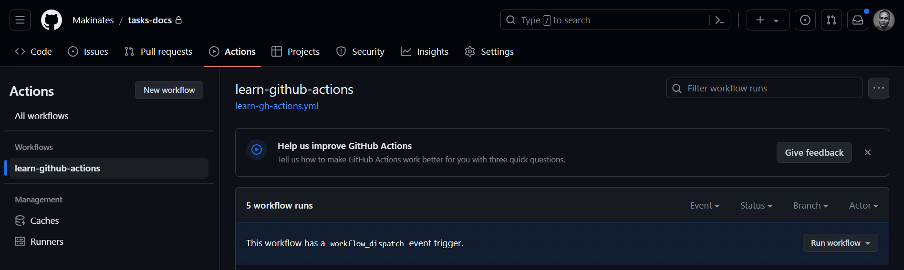
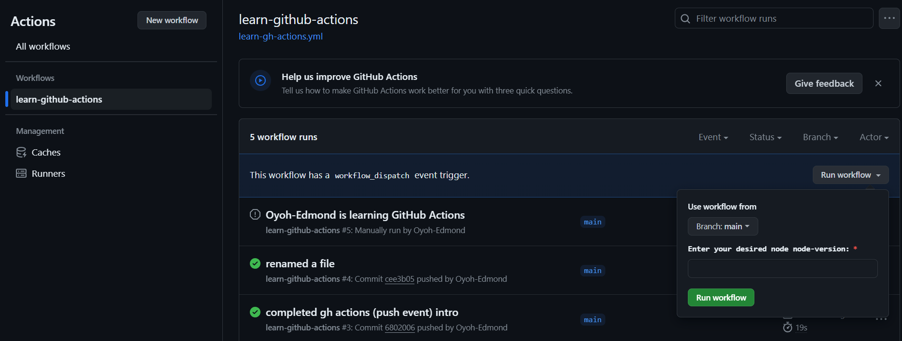
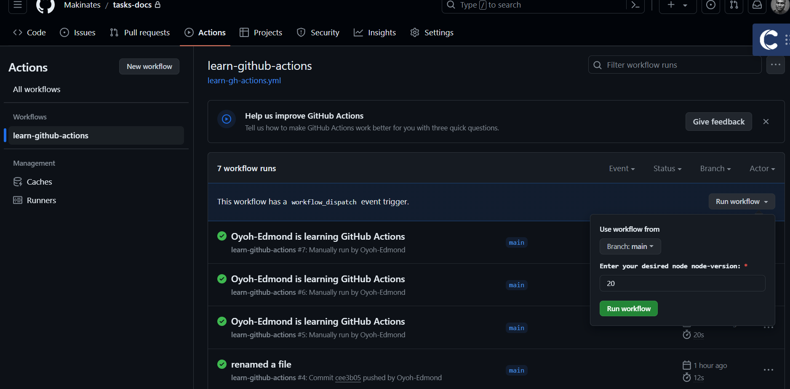
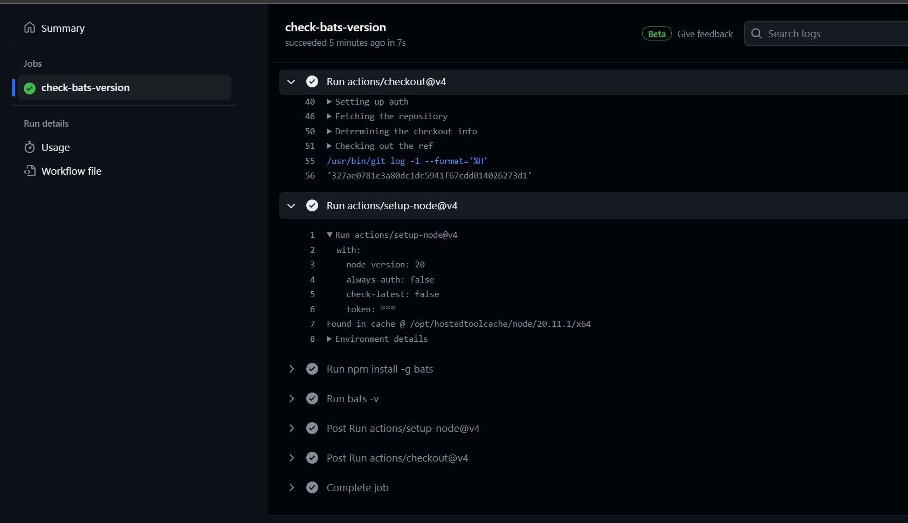

# Create a Simple workflow Using On Workflow_dispatch Event

To manually run a workflow, it must be set up to trigger on the workflow_dispatch event. This event can only be triggered from the default branch of your repository

## Providing inputs
In your workflow, you have the option to define custom input properties, set default values, and specify required inputs for the event. When triggering the event, you can provide the reference and any inputs. During the workflow execution, you can access these input values in the inputs context. For more information, see ["Contexts."](https://docs.github.com/en/actions/learn-github-actions/contexts)

## Usage

```yaml
name: learn-github-actions
on: 
    workflow_dispatch:
        inputs: 
          node-version:
            description: 'Enter your desired node node-version:'
            required: true
            type: number

jobs:
  check-bats-version:
    runs-on: ubuntu-latest
    steps:
      - uses: actions/checkout@v4
      - uses: actions/setup-node@v4
        with:
          node-version: ${{inputs.node-version}}
      - run: npm install -g bats
      - run: bats -v
```            

_This example defines inputs called `node-version`. You pass values for these inputs to the workflow when you run it. This workflow then setup the `node version` as provided in `the input` _


## Viewing the activity for a workflow run
1. On GitHub.com, navigate to the main page of the repository.

1. Under your repository name, click  Actions.
1. In the left sidebar, click the name of the workflow you want to run.


     

1. Above the list of workflow runs, click the Run workflow button.

     

      _Note: To see the Run workflow button, your workflow file must use the workflow_dispatch event trigger. Only workflow files that use the workflow_dispatch event trigger will have the option to run the workflow manually using the Run workflow button._

1. The workflow requires input, fill in the fields.

    

1. Click Run workflow and check the ouput

    


_Congratulations! You have successfully created a simple Github Actions using the on workflow_dispatch event._