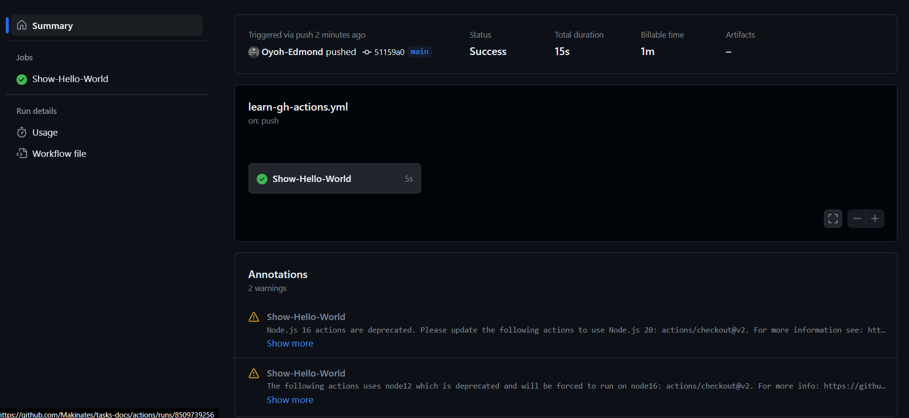
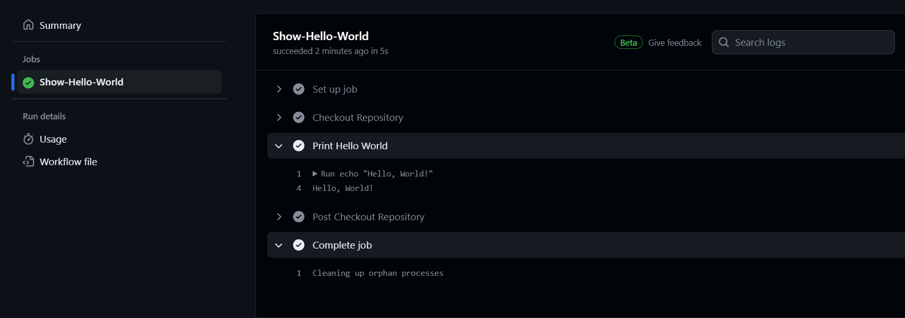

# Introduction into Github Actions

GitHub Actions is a CI/CD platform enabling automation of your build, test, and deployment pipeline. You can craft workflows to build and test every pull request or deploy merged changes to production.

It allows triggering workflows based on various repository events. GitHub furnishes Linux, Windows, and macOS virtual machines for workflow execution, or you can utilize self-hosted runners in your data center or cloud infrastructure.

## The Components of GitHub Actions

GitHub Actions workflows can be triggered by events in your repository, like opening a pull request or creating an issue. Workflows consist of jobs that run in separate environments, executing steps such as running scripts or using reusable actions to automate tasks.

- Workflows

    A workflow is an automated process defined by a YAML file in your repository. It runs jobs triggered by events, manual triggers, or schedules. Workflows are stored in `.github/workflows` directory in a repository and can perform various tasks, like building and testing pull requests, deploying applications, or managing issues.

- Events

    An event is a specific activity in a repository that triggers a workflow run. These actions include creating a pull request, opening an issue, or pushing a commit. Workflows can also be triggered on a schedule, through REST API requests, or manually.<br>
    _[Click here for more types of events ](https://docs.github.com/en/actions/using-workflows/events-that-trigger-workflows)_


- Jobs

    A job in a workflow consists of a series of steps executed on the same runner. Each step can be either a shell script or an action. Steps run sequentially and can share data between each other. For instance, you can first build an application in one step and then test it in the next.

    You can specify dependencies between jobs. By default, jobs run in parallel, but when one job depends on another, it waits for the dependent job to finish before running. For example, you might have multiple build jobs running in parallel, and a packaging job dependent on all of them. Once all build jobs are successful, the packaging job starts.

- Actions

   An action is a custom application on GitHub Actions that automates common, complex tasks. It helps minimize repetitive code in workflow files by pulling repositories, configuring build environments, or handling authentication with cloud providers.

    You can write your own actions, or you can find actions to use in your workflows in the GitHub Marketplace.

- Runners

    A runner is a server that runs your workflows when they're triggered. Each runner can run a single job at a time. GitHub provides Ubuntu Linux, Microsoft Windows, and macOS runners to run your workflows; each workflow run executes in a fresh, newly-provisioned virtual machine. If you need a different operating system or require a specific hardware configuration, you can host your own runners. For more information about self-hosted runners, see ["Hosting your own runners."](https://docs.github.com/en/actions/hosting-your-own-runners)


## Create a Simple workflow Using On Push Event

GitHub Actions employs YAML syntax to define workflows. Each workflow is stored as a distinct YAML file within your code repository, typically in a directory named `.github/workflows`.

You can create an example workflow in your repository that automatically triggers a series of commands whenever code is pushed. In this workflow, GitHub Actions checks out the pushed code and echoes `hello-world`.

1. In your repository, create the `.github/workflows/` directory to store your workflow files.

    

2. In the .github/workflows/ directory, create a new file called `learn-gh-actions.yml` and add the following code.


    ```yml
        name: Simple Hello world Workflow

        on: [push]

        jobs:
            Show-Hello-World:
                runs-on: ubuntu-latest
                
                steps:
                - 
                    name: Checkout Repository
                    uses: actions/checkout@v4
            
                - 
                    name: Print Hello World
                    run: echo "Hello, World!"
    ```        
3. Commit these changes and push them to your GitHub repository.

    _Your new GitHub Actions workflow file is now installed in your repository and will run automatically each time someone pushes a change to the repository._

## Understanding the workflow file

To help you understand how YAML syntax is used to create a workflow file, this section explains each line of the introduction's example:

| Yaml      | Description                       | Explaination        |
|-----------|-----------------------------------|---------            |
| name      | Simple Hello world Workflow       |  Optional - The name of the workflow as it will appear in the "Actions" tab of the GitHub repository. If this field is omitted, the name of the workflow file will be used instead.|
|      on       |   push                        |     This workflow is triggered by the `push` event, meaning it runs whenever someone pushes changes to the repository or merges a pull request. It's configured to trigger on pushes to any branch. You can adjust the syntax to run the workflow only on specific branches, paths, or tags as needed.                 |
|jobs ||Groups together all the jobs that run in the learn-gh-actions workflow.|
|| Show-Hello-World:<br><br>runs-on: ubuntu-latest<br><br><br> steps: <br><br><br><br> name: Checkout Repository <br><br><br><br><br>  - uses: actions/checkout@v4  <br><br><br><br><br><br>  run: echo "Hello, World!" |Defines a job named `Show-Hello-World`. The child keys will define properties of the job.<br><br> Configures the job to run on the latest version of an Ubuntu Linux runner. This means that the job will execute on a fresh virtual machine hosted by GitHub.<br><br><br> Groups together all the steps that run in the `Show-Hello-World` job. Each item nested under this section is a separate action or shell script. <br><br><br><br> Optional - The name of the step as it gives information of the step to be taken. <br><br><br><br><br> The `uses` keyword specifies that this step will run `v4` of the actions/checkout action. This is an action that checks out your repository onto the runner, allowing you to run scripts or other actions against your code (such as build and test tools). You should use the checkout action any time your workflow will use the repository's code. <br><br><br><br><br><br> The `run` keyword tells the job to execute a command on the runner. In this case, you are using echo `Hello world`|


## Viewing the activity for a workflow run

When your workflow is triggered, a workflow run is created that executes the workflow. After a workflow run has started, you can see a visualization graph of the run's progress and view each step's activity on GitHub.

1.  On GitHub.com, navigate to the main page of the repository.

     


1.  Under your repository name, click  Actions.

     

1. In the left sidebar, click the workflow you want to see.

    

1. From the list of workflow runs, click the name of the run to see the workflow run summary.

    

1. In the left sidebar or in the visualization graph, click the job you want to see <br> To view the results of a step, click the step.

    

_Congratulations! You have successfully created a simple Github Actions using the on push event._

