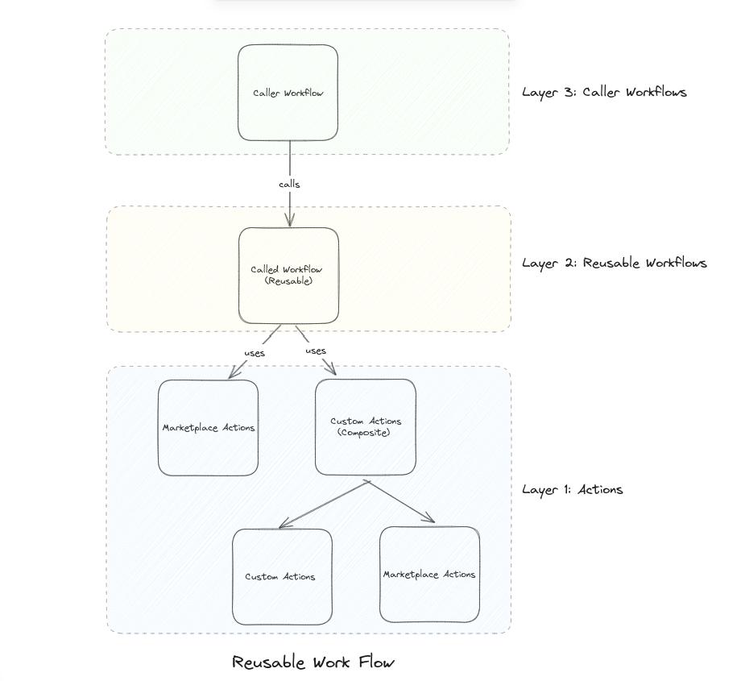

# How to Create a GitHub Actions CI/CD Pipeline for Docker Image Build, Push, and ECS Deployment

This documentation will guide you through the process of creating a GitHub Actions CI/CD pipeline that builds a Docker image, pushes it to a container repository (Docker Hub), and deploys it to a running Amazon Elastic Container Service (ECS) cluster.

## Prerequisites

Before starting, ensure that you have the following:

- An AWS account with appropriate permissions to access ECS, ECR, and other required services.

- An ECS cluster that has already been provisioned and is running. See our guide on how to provision an ECS cluster [with Terraform](./04%20-%20How%20to%20provision%20and%20deploy%20to%20ECS%20with%20Terraform.md) or [via the AWS Management Console](./03%20-%20Deploying%20to%20ECS%20from%20the%20AWS%20Console.md)

- A Docker Hub account for pushing the Docker image.

- A GitHub repository containing the application code and the necessary configuration files.

## Overview

The pipeline is composed of three main components:

1. A repository for a custom GitHub Action (`Makinates/daniel-docker-ecs-action`).
2. A repository containing a reusable GitHub Actions workflow (`Makinates/daniel-gha-ecs/.github/workflows/reuseable-docker-to-ecs.yml`).
3. A sample repository with a workflow that calls the reusable workflow (`Makinates/daniel-sample-caller-workflow/.github/workflows/ci-cd-caller.yml`).

The custom action (`Makinates/daniel-docker-ecs-action`) is a composite action responsible for building, pushing, and deploying the Docker image to ECS. The reusable workflow (`Makinates/daniel-gha-ecs/.github/workflows/reuseable-docker-to-ecs.yml`) acts as an intermediary, calling the custom action with the required inputs and can be extended with other actions. The sample repository (`Makinates/daniel-sample-caller-workflow/.github/workflows/ci-cd-caller.yml`) demonstrates how to call the reusable workflow with the necessary configuration.



## Layer 3 Repository Structure: Caller Workflow

The sample repository is structured as follows:

```sh
./
├── .github/
│   └── workflows/
│       └── ci-cd-caller.yml
├── nodeapp/
│   ├── views/
│   ├── Dockerfile
│   ├── package.json
│   ├── pnpm-lock.yaml
│   └── server.js
└── README.md
```

Here's a breakdown of the files and directories:

- `.github/workflows/ci-cd-caller.yml`: This file contains the workflow that calls the reusable workflow for the CI/CD pipeline.
- `nodeapp/`: This directory contains the application code and the Dockerfile.
- `Dockerfile`: This file defines the Docker image configuration for the application.
- `package.json`, `pnpm-lock.yaml`, and `server.js`: These are the application files specific to the Node.js application used in this example.
- `README.md`: This file provides additional information about the repository.

### ci-cd-caller.yml

```yaml
name: Caller Workflow

on:
  push:
    branches: [ main ]
  workflow_dispatch:

jobs:
  call-docker-to-ecs:
    uses: Makinates/daniel-gha-ecs/.github/workflows/reuseable-docker-to-ecs.yml@main
    with:
      aws-region: us-east-1
      dockerfile-path: ./nodeapp/Dockerfile
      ecs-cluster-name: makinode-app-cluster
      ecs-service-name: makinode-app-service
      ecs-task-definition-family: makinode-app-task
      container-image-name: makinode-app-container
      container-image-tag: ${{ github.sha }}
    secrets:
      aws-access-key-id: ${{ secrets.AWS_ACCESS_KEY_ID }}
      aws-secret-access-key: ${{ secrets.AWS_SECRET_ACCESS_KEY }}
      docker-hub-username: ${{ secrets.DOCKER_HUB_USERNAME }}
      docker-hub-password: ${{ secrets.DOCKER_HUB_PASSWORD }}
```

This workflow is triggered on a push to the `main` branch or a manual workflow dispatch. It calls the reusable workflow (`reuseable-docker-to-ecs.yml`) from the `Makinates/daniel-gha-ecs` repository and provides the necessary inputs and secrets.

The `with` section specifies the following inputs:

- `aws-region`: The AWS region where the ECS cluster is located.
- `dockerfile-path`: The path to the Dockerfile for building the Docker image.
- `ecs-cluster-name`: The name of the ECS cluster to which the service will be deployed.
- `ecs-service-name`: The name of the ECS service to be updated.
- `ecs-task-definition-family`: The family name of the ECS task definition.
- `container-image-name`: The name of the Docker image.
- `container-image-tag`: The tag for the Docker image (in this case, the Git commit SHA).

The `secrets` section specifies the following secrets:

- `aws-access-key-id`: The AWS access key ID for authentication.
- `aws-secret-access-key`: The AWS secret access key for authentication.
- `docker-hub-username`: The Docker Hub username for pushing the Docker image.
- `docker-hub-password`: The Docker Hub password for pushing the Docker image.

> **NOTE:** It is on this layer (at the caller workflow level) you should define your Secrets and Environment Variables. Go to `Settings` -> `Secrets and Variables`. Click on `New repository secret` to add secrets. Select the `Variables` tab and `New repository variable` to add Environment Variables.

### Dockerfile

```dockerfile
FROM node:21-alpine

WORKDIR /app

COPY nodeapp/package*.json ./

RUN npm install

COPY nodeapp/ ./

EXPOSE 3001

CMD ["node", "server.js"]
```

> This Dockerfile is used to build the Docker image for the Node.js application. It sets up the necessary environment, installs dependencies, copies the application code, exposes the port `3001`, and specifies the command to start the application.

## Layer 2: Reusable (Called) Workflow

The reusable workflow (`reuseable-docker-to-ecs.yml`) is stored in the `Makinates/daniel-gha-ecs` repository. It is called by the `Makinates/daniel-sample-caller-workflow/.github/workflows/ci-cd-caller.yml` workflow and executes the custom action (`Makinates/daniel-docker-ecs-action@main`) responsible for building, pushing, and deploying the Docker image to ECS.

```yaml
name: Reuseable CI/CD Workflow for Docker to ECS Deployment

on:
  workflow_call:
    inputs:
      aws-region:
        type: string
        required: false
        default: us-east-1
      dockerfile-path:
        type: string
        required: true
      ecs-cluster-name:
        type: string
        required: true
      ecs-service-name:
        type: string
        required: true
      ecs-task-definition-family:
        type: string
        required: true
      container-image-name:
        type: string
        required: true
      container-image-tag:
        type: string
        required: true
    secrets:
      aws-access-key-id:
        required: true
      aws-secret-access-key:
        required: true
      docker-hub-username:
        required: true
      docker-hub-password:
        required: true

jobs:

  deploy:
    runs-on: ubuntu-latest

    steps:
    - name: Checkout code
      uses: actions/checkout@v3

    - name: Deploy to ECS
      uses: Makinates/daniel-docker-ecs-action@main
      with:
        aws-region: ${{ inputs.aws-region }}
        aws-access-key-id: ${{ secrets.aws-access-key-id }}
        aws-secret-access-key: ${{ secrets.aws-secret-access-key }}
        docker-hub-username: ${{ secrets.docker-hub-username }}
        docker-hub-password: ${{ secrets.docker-hub-password }}
        dockerfile-path: ${{ inputs.dockerfile-path }}
        ecs-cluster-name: ${{ inputs.ecs-cluster-name }}
        ecs-service-name: ${{ inputs.ecs-service-name }}
        ecs-task-definition-family: ${{ inputs.ecs-task-definition-family }}
        container-image-name: ${{ inputs.container-image-name }}
        container-image-tag: ${{ inputs.container-image-tag }}
```

The reusable workflow is triggered by a `workflow_call` event and accepts the same inputs and secrets as the caller workflow.

It defines a single job (`deploy`) that runs on the `ubuntu-latest` runner and consists of two steps:

1. **Checkout code**: This step checks out the repository code using the `actions/checkout@v3` action.

2. **Deploy to ECS**: This step uses the custom action `Makinates/daniel-docker-ecs-action@main` to perform the Docker image build, push, and ECS deployment. The `with` section passes the required inputs and secrets to the custom action.

## Layer 1: Custom (Composite) Action

The custom action (`Makinates/daniel-docker-ecs-action@main`) is responsible for the actual implementation of the CI/CD pipeline. Let's take a closer look at its `action.yml` file.

```yaml
name: 'Push to Docker Hub & Deploy to ECS'

description: 'Build Docker image, push to Docker Hub, and deploy to Amazon ECS'

inputs:
  aws-region:
    description: 'AWS region'
    default: 'us-east-1'
    required: false
  aws-access-key-id:
    description: 'AWS access key ID'
    required: true
  aws-secret-access-key:
    description: 'AWS secret access key'
    required: true
  docker-hub-username:
    description: 'Docker Hub username'
    required: true
  docker-hub-password:
    description: 'Docker Hub password'
    required: true
  dockerfile-path:
    description: 'Path to Dockerfile'
    required: true
  ecs-service-name:
    description: 'ECS Service Name'
    required: true
  ecs-cluster-name:
    description: 'ECS Cluster Name'
    required: true
  ecs-task-definition-family:
    description: 'ECS Task Definition Family'
    required: true
  container-image-name:
    description: 'Container Image Name'
    required: true
  container-image-tag:
    description: 'Container Image Tag'
    required: true

runs:
  using: 'composite'
  steps:
    - name: Configure AWS credentials
      uses: aws-actions/configure-aws-credentials@v1
      with:
        aws-access-key-id: ${{ inputs.aws-access-key-id }}
        aws-secret-access-key: ${{ inputs.aws-secret-access-key }}
        aws-region: ${{ inputs.aws-region }}

    - name: Build & push Docker image
      id: build-image
      uses: mr-smithers-excellent/docker-build-push@v6
      with:
        image: ${{ inputs.docker-hub-username }}/${{ inputs.container-image-name }}
        tags: ${{ inputs.container-image-tag }}
        registry: docker.io
        dockerfile: ${{ inputs.dockerfile-path }}
        username: ${{ inputs.docker-hub-username }}
        password: ${{ inputs.docker-hub-password }}
```

The custom action defines the inputs required for the CI/CD pipeline, including AWS credentials, Docker Hub credentials, Dockerfile path, ECS service and cluster details, and container image information.

Here's a breakdown of the steps in the custom action:

- **Configure AWS credentials**: This step configures the AWS credentials using the `aws-actions/configure-aws-credentials@v1` action. It sets the AWS access key ID, secret access key, and region using the provided inputs.

- **Build & push Docker image**: This step builds the Docker image and pushes it to Docker Hub using the `mr-smithers-excellent/docker-build-push@v6` action. It specifies the Docker image name, tag, registry, Dockerfile path, and Docker Hub credentials using the provided inputs.

```yaml
- name: Download task definition
  run: |
    aws ecs describe-task-definition --task-definition ${{ inputs.ecs-task-definition-family }} --query taskDefinition > task-definition.json
  shell: bash

- name: Fill in the new image ID in the Amazon ECS task definition
  id: task-def
  uses: aws-actions/amazon-ecs-render-task-definition@v1
  with:
    task-definition: task-definition.json
    container-name: ${{ inputs.container-image-name }}
    image: ${{ steps.build-image.outputs.imageFullName }}:${{ inputs.container-image-tag }}

- name: Deploy to Amazon ECS
  uses: aws-actions/amazon-ecs-deploy-task-definition@v1
  with:
    task-definition: ${{ steps.task-def.outputs.task-definition }}
    service: ${{ inputs.ecs-service-name }}
    cluster: ${{ inputs.ecs-cluster-name }}
    wait-for-service-stability: true
```

- **Download task definition**: This step downloads the current ECS task definition using the AWS CLI `aws ecs describe-task-definition` command. It saves the task definition as a JSON file (`task-definition.json`).

- **Fill in the new image ID in the Amazon ECS task definition**: This step uses the `aws-actions/amazon-ecs-render-task-definition@v1` action to update the task definition with the new Docker image ID. It replaces the container image with the one built and pushed in the previous step.

- **Deploy to Amazon ECS**: This step uses the `aws-actions/amazon-ecs-deploy-task-definition@v1` action to deploy the updated task definition to the specified ECS service and cluster. It waits for the service to stabilize after the deployment.

## Verifying CI/CD Pipeline

From the ECS guides, we have a running ECS infrastructure with a service running two tasks using the `simple-node-app` image from our docker hub repository.


To test the CI/CD pipeline, we will update the application code and push it to the application repository (in this case, `Makinates/daniel-sample-caller-workflow/`). You can also trigger the workflow manually from the `Actions` tab.


Wait for successful deployment


View app in browser


