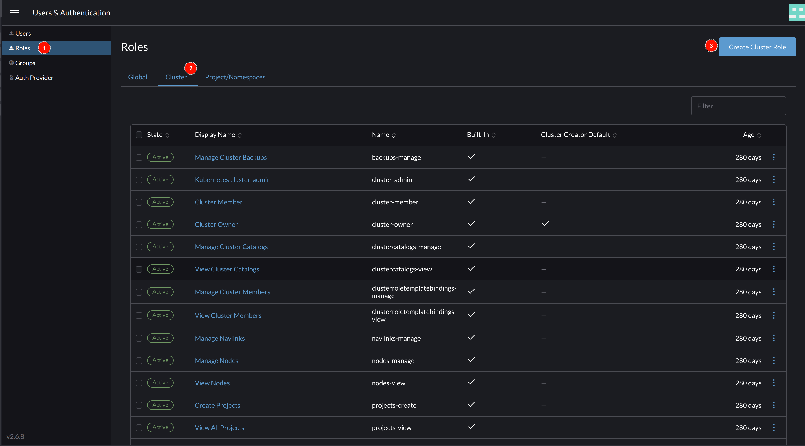
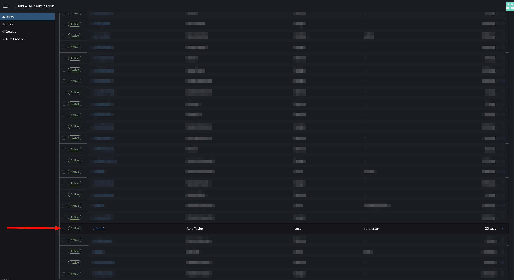
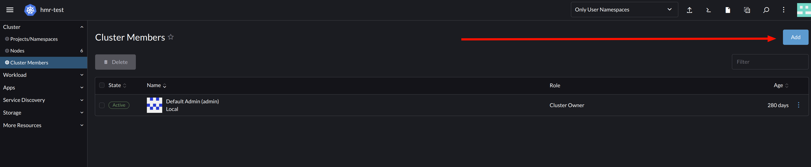
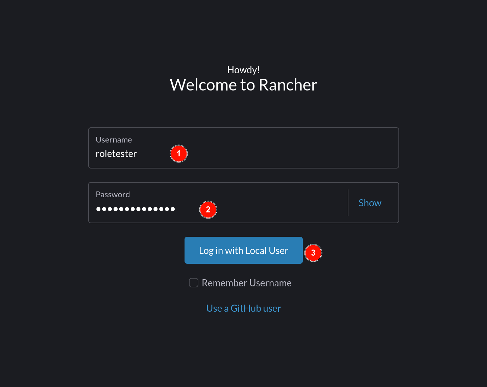
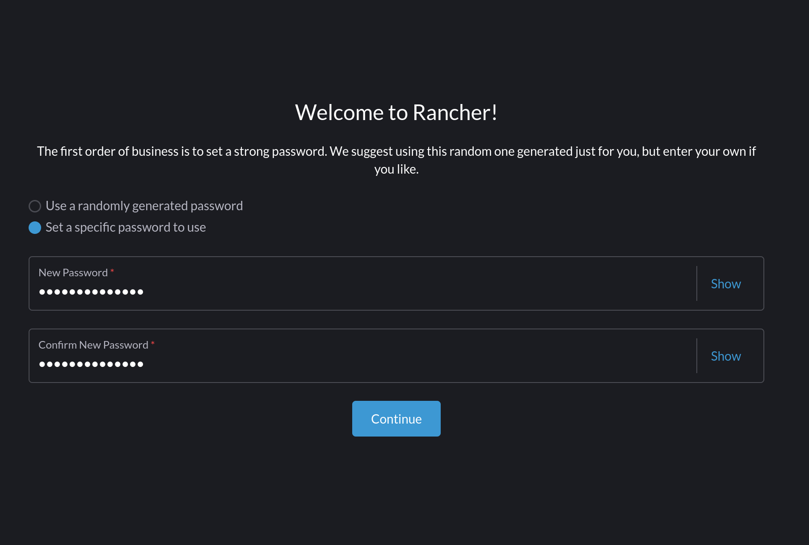
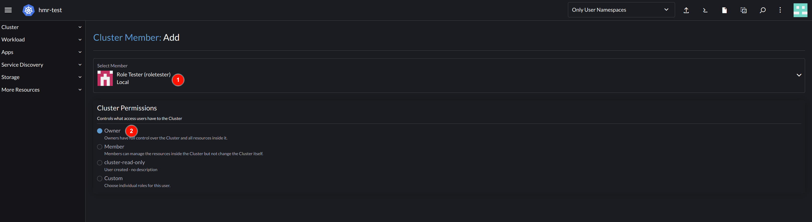

# How to create cluster roles in a Rancher Kubernetes Environment

Amazon Elastic Containe

## Step 1: Create Read-Only Cluster Member

- Log into your Rancher admin dasboard with permissions to create and manage users. Open the menu and click on `Users & Authentication`

- Start creating the role with read-only permissions. Select `Roles` in side menu, navigate to `Cluster` tab, and click on the `Create Cluster Role` button.

- 

