# How to create cluster roles in a Rancher Kubernetes Environment

This task requires you to create two user roles that can be added to Cluster Members in each of the Rancher Kubernetes Clusters.

The first role will be for a Read-Only user who is only able to `get`, `list`, and `watch` resources but cannot `create`, `update`, or `delete` resources in the cluster.

The second role will be for a Full Admin user who will have all privileges on the cluster he is a member of.

This task will be limited to a test cluster (`hmr-test` in this case), but can be replicated on all/any cluster in the Rancher Kubernetes Environment.

## Step 1: Create Read-Only Role

- Log into your Rancher admin dasboard with permissions to create and manage users. Open the menu and click on `Users & Authentication`

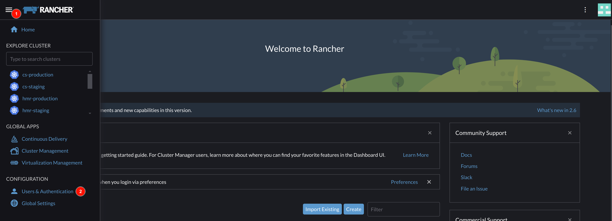

- Start creating the role with read-only permissions. Select `Roles` in side menu, navigate to `Cluster` tab, and click on the `Create Cluster Role` button.

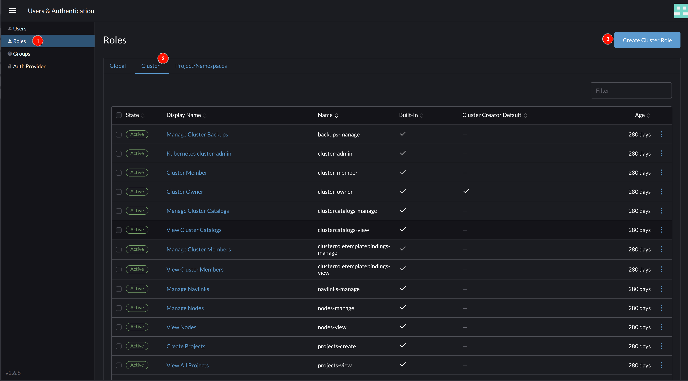

- Give the Cluster Role a name and description. You can use the `Grant Resources` for granular RBACs. Here we will inherit from the in-built Read-Only template. Go to the `Inherit From` and choose `Read-only` from the dropdown. Click on the `Create` button.

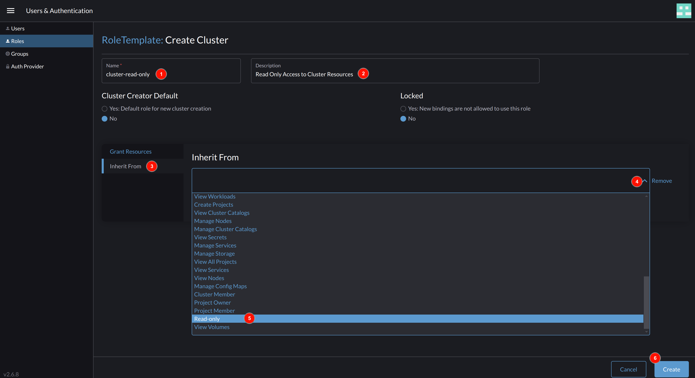

- Return to the `Roles` list page to view your newly created role.

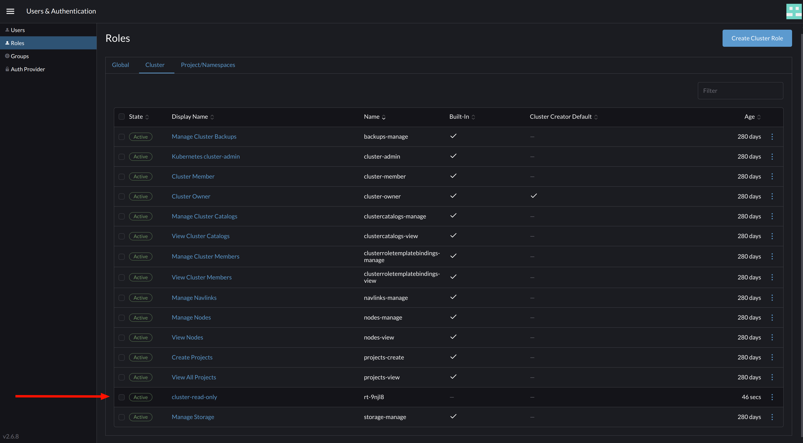

## Step 2: Create User

- Navigate to `Users` page from the side menu and click on the `Create` button.

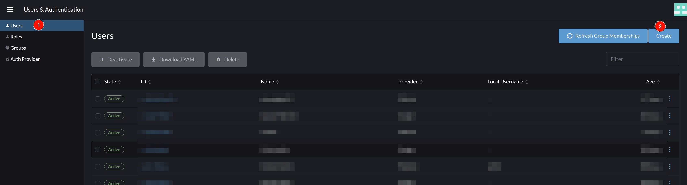

- On the user creation page, enter a new unique username, display name, description, and password. This user will only be granted access to the Kubernetes cluster it is a member of and will not be able to other Rancher Management features. Hence, we will give this user the ability to only be able to logon to Rancher and access the Kubernetes cluster. To do this, select only `User-Base` under `Global Permissions`. Click on the `Create` button to create the user.

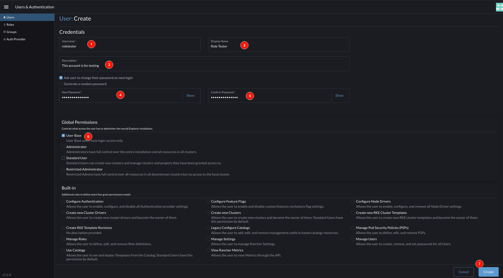

- Return to the `Users` list page to view the newly created user.

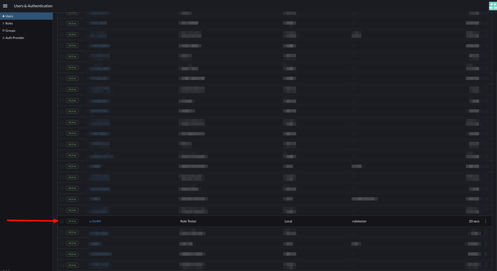

## Step 3: Add user to Kubernetes Cluster

- From the menu, search and select the cluster you desire to add the user unto.

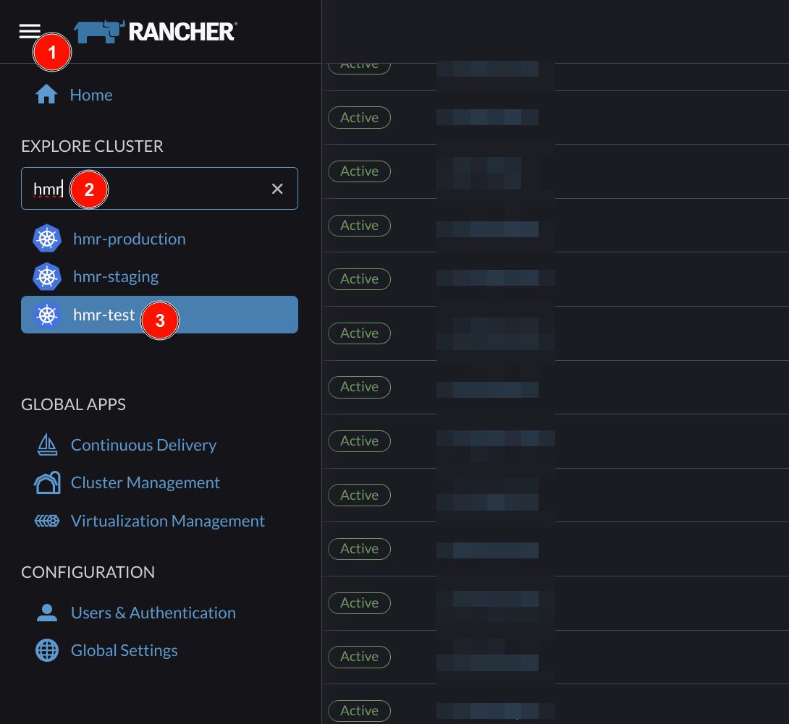

- From the Cluster Dashboard's side menu, select `Cluster Members`.

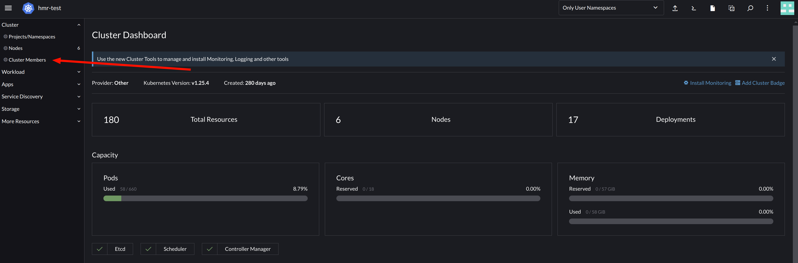

- Click the `Add` button.

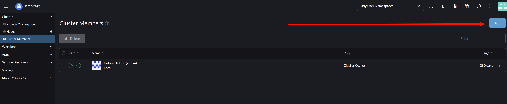

- Select the user you created previously and under `Cluster Permissions`, select the role you created earlier. In this case, the Read-Only role. Hence, this user should only be able read resource and unable to create, modify, or delete resources in the cluster.

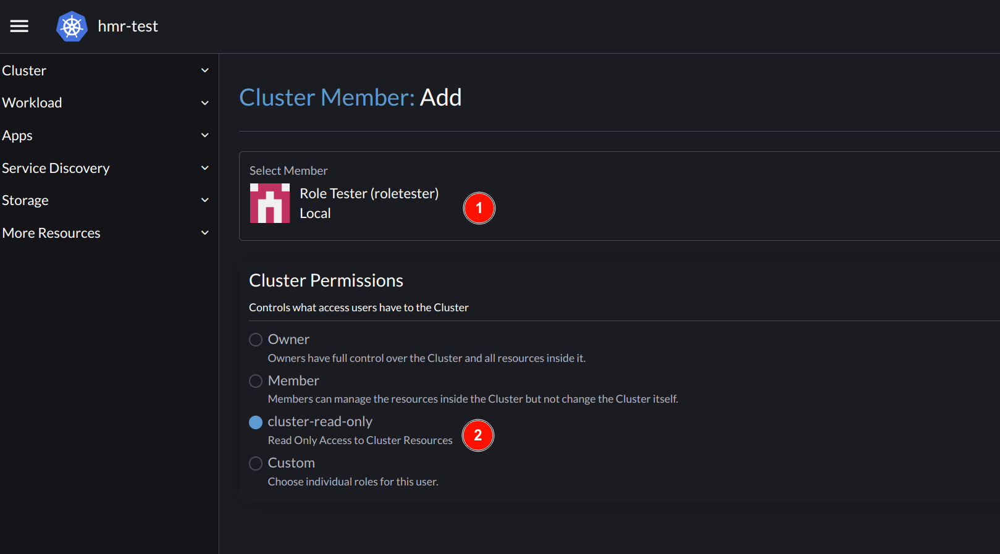

- To test this out, from a new browser session, visit the Rancher Dashboard to login. Select `Use a local user`

- Login with user details created earlier.

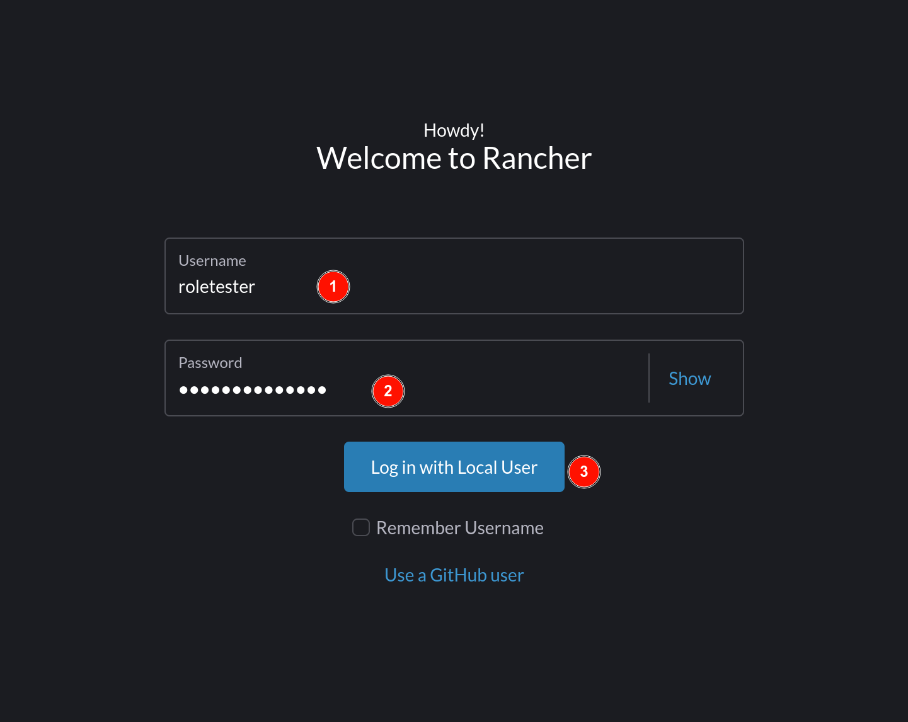

- Create a new password if required to do so.

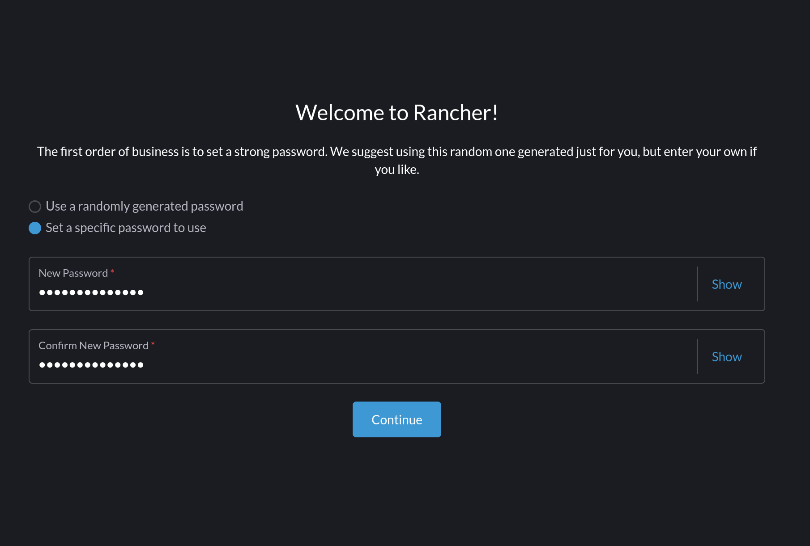

- Upon loggin in, the user will only be able to see clusters they have been added unto. Click the cluster name to go into the Cluster Dashboard.

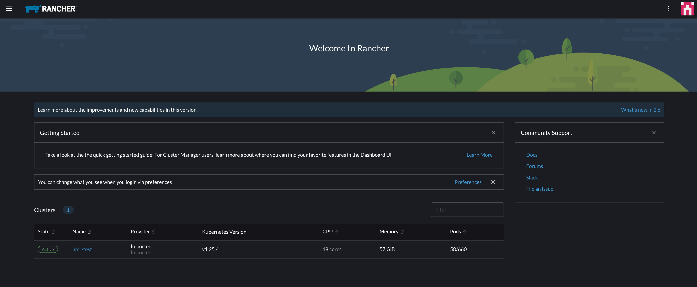

- Click on the `Kubectl Shell` button in the top right menu to start-up and reveal a new terminal panel for giving `kubectl` commands. If we enter a `get` command, we are given a successful response, because this user has read permissions. However, when we try to create a new resource, we get an error, because this user has not been given the permission to create any resource.

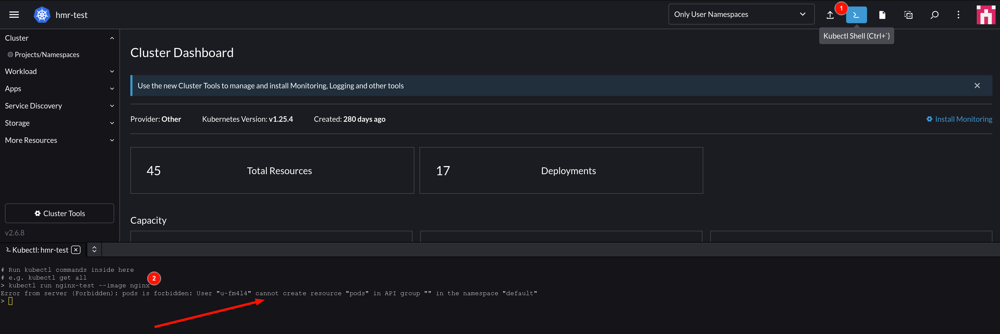

- To see all the permissions the user has in this cluster, run `kubectl auth can-i --list`.

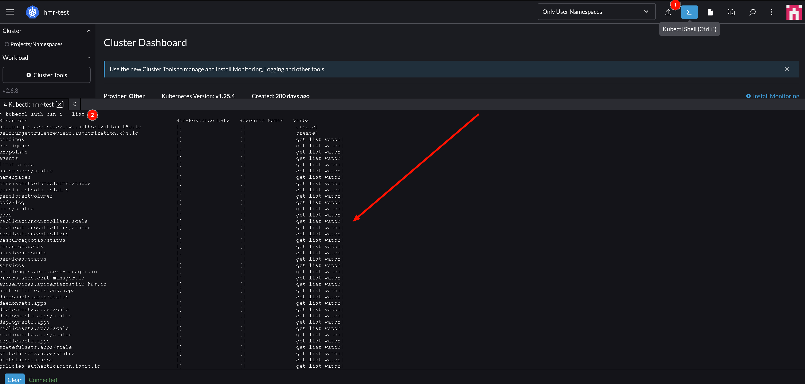

## Step 4: Add Admin User to Cluster

- Return to browser where you're logged in with the Rancher Admin User with permissions to manage user.

- This task requires an Admin user to also be added to the cluster with full privileges. The process of creating a new user outlined in `Step 2` can be followed to create the admin user. However, the cluster comes with an in-built `Cluster Owner` role which is a full admin role with all privileges. We will use this. For our test, we will also use the same user we created earlier. First, we will delete the user and role-binding from the `Cluster Members` list.

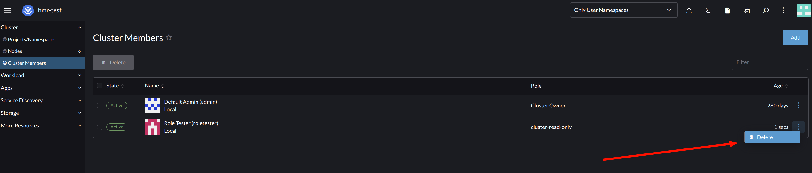

- Click the `Add` button and select the user. Now, select `Owner` under the `Cluster Permissions` and save.

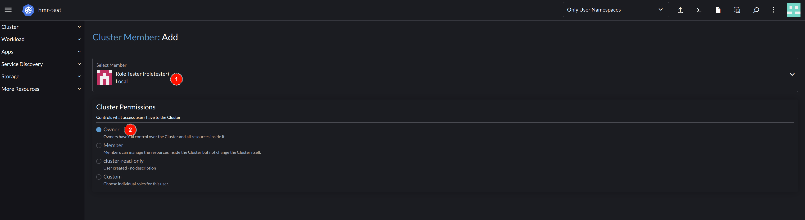

- In a separate browser, log in with the new user created earlier. Now, run `kubectl auth can-i '*' '*'` to see if the admin user has full privileges in the cluster as required. You can also try to create and delete resources.

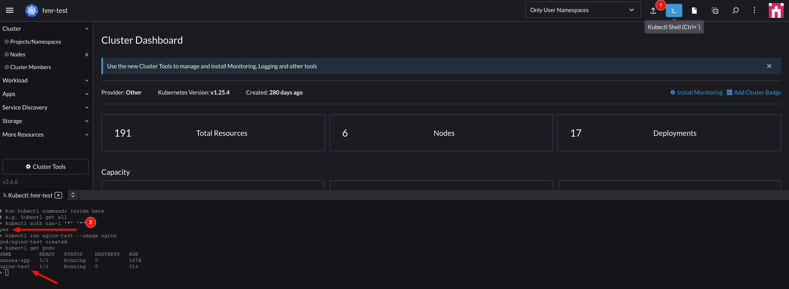
