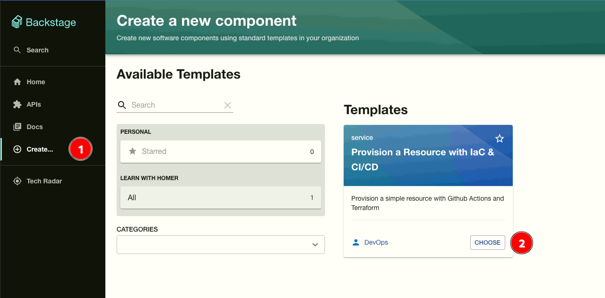
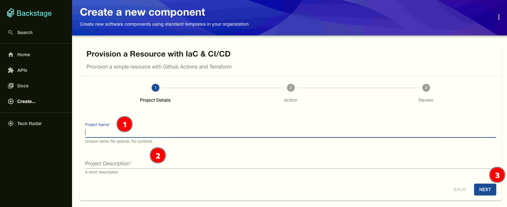
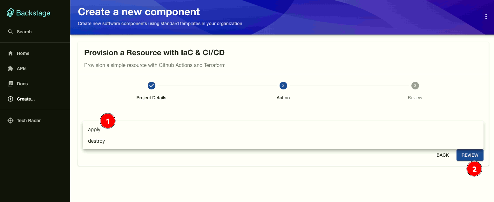
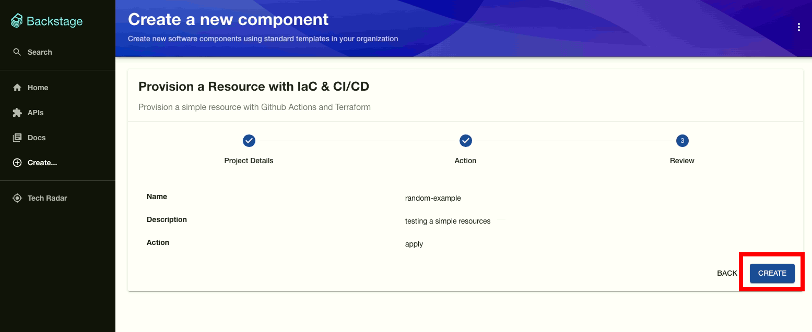
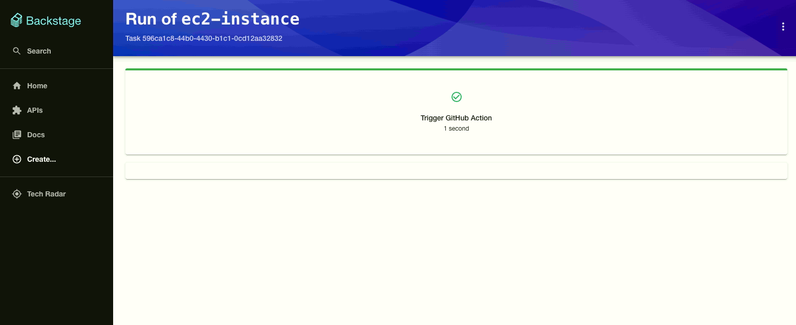
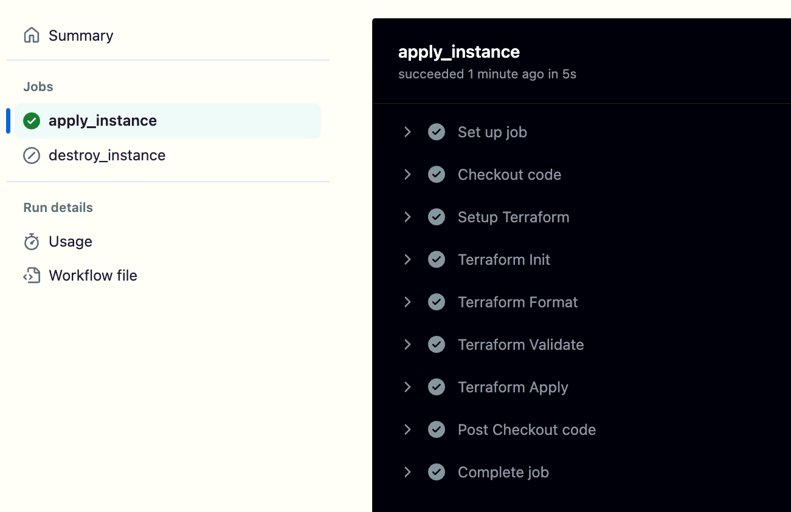

# How to Use a Backstage Template to Trigger a Pipeline

1. Click on the `Create...` link in the side menu and click `CHOOSE` button on the template card you want to use.

- Fill the form as required by the template and click on `NEXT` to proceed.

- Select the action to be performed by the pipeline and click on `REVIEW` to proceed.

- Review the options and click on `CREATE` to proceed.

- The pipeline will be triggered and you can monitor the progress of the pipeline.

- Once the pipeline is completed, you can view the results of the pipeline.

