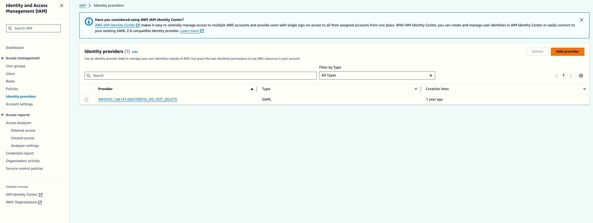
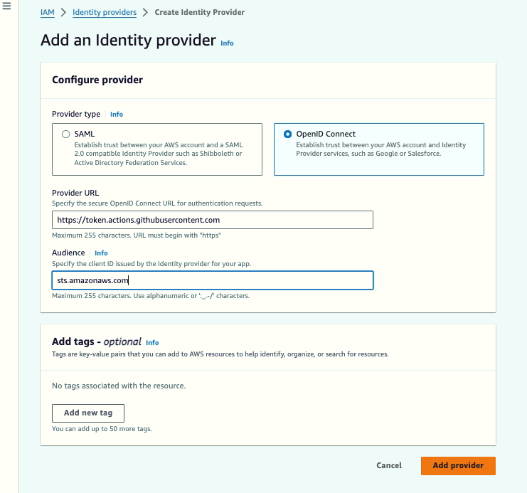
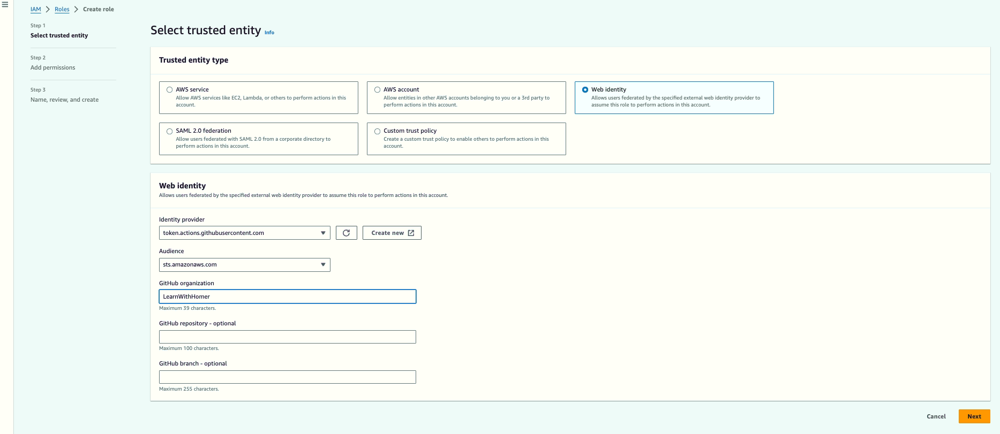
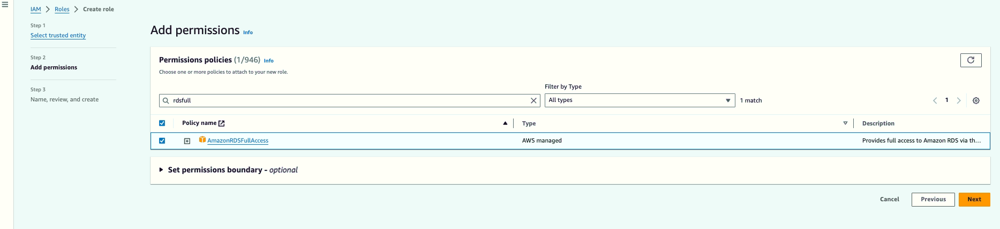

# Steps to set up the OIDC provider in AWS for use in Github Actions

## Step 1: Setup OIDC Provider

- Go to the IAM console in AWS
- In the left navigation pane, choose "Identity providers"
- Choose "Add provider"



- For "Provider type", select "OpenID Connect"
- For "Provider URL", enter: `https://token.actions.githubusercontent.com`
- For "Audience", enter: `sts.amazonaws.com`
- Click "Add provider"



## Step 2: Create a new IAM role

- In the IAM console, go to "Roles" and click "Create role"
- Choose "Web identity" as the trusted entity type
- For "Identity provider", choose `token.actions.githubusercontent.com`
- For "Audience", choose `sts.amazonaws.com`
- Add any additional conditions if needed (like restricting to specific repos)



- Attach the necessary permissions policies



- Name and create the role

> Ensure the Trust Policy JSON has all the necessary entries to create the trust relationship and permissions as selected and entered from previous steps.

## Step 3: Use role in GitHub Actions

- In the action step that configures AWS CLI, use `role-to-assume` to authenticate by using the following role ARN format:

```yaml
role-to-assume: arn:aws:iam::YOUR_ACCOUNT_ID:role/YOUR_ROLE_NAME
```

>Replace `YOUR_ACCOUNT_ID` with your AWS account ID and `YOUR_ROLE_NAME` with the name you gave to this new IAM role.

This setup allows GitHub Actions to securely authenticate with AWS using OIDC, without the need for long-lived AWS credentials stored as GitHub secrets.
